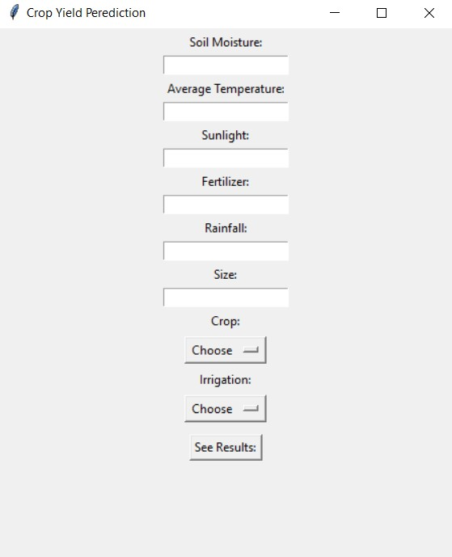
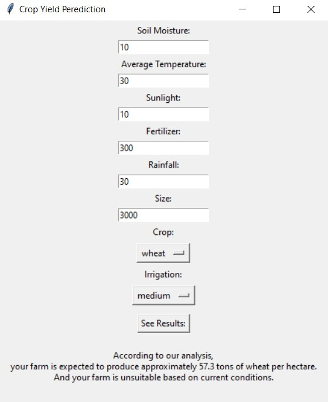

# Crop Yield Prediction & Condition Classification 🌾

This project demonstrates the development of a machine learning system for crop yield prediction and crop condition classification. A synthetic agricultural dataset was generated, containing features such as soil moisture, temperature, fertilizer usage, rainfall, sunlight hours, and previous farming history.

The dataset was preprocessed by handling missing values, treating outliers, and preparing numerical features through a machine learning pipeline. These preprocessing steps ensure that the models receive clean and consistent input data.

Two different machine learning tasks were implemented within the project. A Linear Regression model was trained to estimate crop yield, while a K-Nearest Neighbors (KNN) classifier was used to predict whether crop conditions are favorable. Model performance was evaluated using appropriate regression and classification metrics.

To make the project more interactive, a graphical user interface (GUI) was developed using Tkinter. The interface allows users to enter agricultural parameters and instantly receive predictions generated by the trained machine learning models.

Overall, this project demonstrates a complete machine learning workflow, including data generation, preprocessing, model training, evaluation, model persistence, and deployment through a desktop application.

---

## 📁 Project Structure

```
.
├── notebook.ipynb        # Data generation, preprocessing, model training & evaluation
├── gui.ipynb              # Tkinter desktop application for making predictions
├── regressor.joblib        # Saved trained regression model (generated by notebook.ipynb)
├── classifier.joblib       # Saved trained classification model (generated by notebook.ipynb)
├── requirements.txt
└── README.md
```

## 🧠 Features

- Synthetic dataset generation with realistic agricultural features (moisture, temperature, sunlight, fertilizer, rainfall, farm size, crop type, irrigation level)
- Data cleaning: missing value imputation and outlier treatment (IQR clipping)
- Preprocessing pipeline with `StandardScaler`, `OrdinalEncoder`, and `OneHotEncoder` via `ColumnTransformer`
- Multiple regression models compared (Linear Regression, Polynomial Regression degree 2 & 3), best one selected by MSE
- Multiple classifiers compared (Logistic Regression, KNN with several values of _k_), best one selected by accuracy
- Trained models persisted with `joblib` for reuse
- Desktop GUI (Tkinter) that loads the saved models and returns instant predictions

## 🖥️ Screenshots

| Empty form                              | Form with prediction                           |
| --------------------------------------- | ---------------------------------------------- |
|  |  |

## 🚀 Usage

1. **Train the models** (optional — pre-trained `.joblib` files are already included):
   Open and run all cells in `notebook.ipynb`. This will regenerate `regressor.joblib` and `classifier.joblib`.

2. **Run the GUI:**
   Open `gui.ipynb` and run all cells (or convert it to a `.py` script and run it directly). A window will open where you can enter farm parameters and click **"See Results"** to get the predicted crop yield and suitability.

## 🛠️ Tech Stack

- Python 3.13
- pandas, numpy
- scikit-learn
- joblib
- Tkinter (GUI)

## 📌 Notes

- The dataset used in this project is **synthetically generated** for demonstration purposes and does not reflect real-world agricultural measurements.
- This project was built as a learning exercise to practice an end-to-end machine learning workflow: data generation → preprocessing → model training → evaluation → persistence → deployment.
